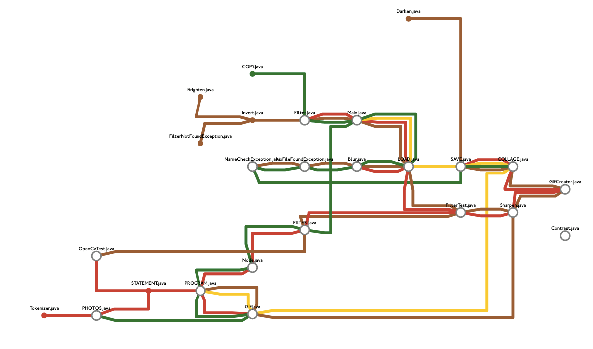

# Visualization Project

## Purpose
We designed a metro map to display the code files and the contributors for a given GitHub project.

The nodes represent the file names and the different coloured lines represent different authors who have contributed to the project.

## The viz process
Our viz runs a chain of analysis and visulization steps to arrive at a result. Broadly analysis is in https://github.com/cpsc410/GithubAnalysis and visulization in https://github.com/cpsc410/viz_metro. We start by executing a bash script which executes various git commands against your repo. Then we parse this data and clean it in typescript. Then this data is written to JSON and passsed to the visualizer. Suprisingly generating metro maps from sets of nodes which should form connected subgraphs is a hard problem (who would have guessed!). To do this, we employ a clustering algorithmn that brings nodes closer together the more potential edges they could have between them and repels nodes with no potential shared edges. This leads to a very messy clustered 2d space. We then employ a variant of prims (no cycles and reduced branching) to connect each subgraph. Then this data is passed into https://github.com/juliuste/transit-map which solves the graph and makes it look like a metro map. They also have a method for generating SVGs, which made our frontend rendering a breeze because we just transformed their SVG to add labels and zoom/pan.  

However, it turns out that the fancy model that https://github.com/juliuste/transit-map uses can't handle inputs as messy and large as ours. And furthermore, their SVG renderer would only look nice if it was run through their model first. This lead to our hideous first user studies because transit-map would outright refuse to solve the model. So as an alternate approach to provide a more readable map, we scrap our coordinates entirely after running prim's and pass the graph itself into graphviz. Then on the frontend we rewrote the renderer to parse JSON output from graphviz and transform it into a more readable map.

## Contributions
#### Code Analysis
- Ceylin: 
  - Wrote the shell script that gathers all the GitHub data
  - Output a .txt from the shell script to serve as input for parser
  - Implemented compile method which used the symbol table values to create a JSON file with required fields that would then be passed on to the Code Visualization component
   - Configured the meow repo to allow for command line arguments from user input that would then be used for configurations
   - Implemented a singleton class for integration of the flags options

- Cyrielle:
  - Parsed .txt input from the shell script
  - Implemented symbol table
  - Added configuration options to each parsing method to limit scope of data for a cleaner output JSON
  - Configured the meow repo to allow for command line arguments from user input that would then be used for configurations

#### Code Visualization
- Ben
  - Designed interfaces for each of the 3 different stages of the processing to interact.
  - Created a typescript force-based layout engine which transforms the input JSON (file, contributors etc) into a directed graph of nodes each with their own coordinates and edges.
  - The coordinates are ultimately discarded but help to produce the graph by clustering files with similiar contributors so that the edges are placed sensibly.
  - Implemented (slightly modified) Prim's algorithm to produce a MSP (treated as a directed graph) of the nodes.
  - Created the video.
  
- Noa
  - Graph post processing to create prettier connections
  - Transforming graph data to feed to https://github.com/juliuste/transit-map solver and SVG renderer
  - Rendering transit-map SVG in frontend with labels and zooming 
  - Reimplemented render to feed graph into graphviz
  - Created frontend script to read graphviz JSON output and render to interactive SVG in browser
  - Wrote script to intergrate project components together into a single command

## Usage
To run the project see [here](https://github.com/cpsc410/runner/blob/master/README.md) and follow the instructions

## Use Cases
We think that this project can be very useful for:
- see who worked on a specific file
-- this could be especially helpful when trying to contact someone to fix a bug
- see what the division of labour was
- see who contributed most to files
- see top contributor(s)

## Analyses Performed
We utilized three different analyses for this project; Lexical, Syntactical and Semantic.

### Lexical Analysis
- done on static input files
- used for tokenizing the stats obtained by running the shell script (getStatsAll.sh)

### Syntactical Analysis
- done on static input files
- used for creating grammar for the stats.txt input file
- the grammar was included in the ast folder which contained the AuthorNode and FileNode

### Semantic Analysis
- used for identification of the meaning
- used dynamic analysis when adding symbol and values in the symbol table -- it could only be populated when the program was running 

## Prototype Progression
User studies have really helped us with developing our protypes further. See [PrototypeProgression.pdf](https://github.com/cpsc410/docs/blob/master/PrototypeProgression.pdf)

## User Studies
See [UserStudies.pdf](https://github.com/cpsc410/docs/blob/master/UserStudies.pdf)

